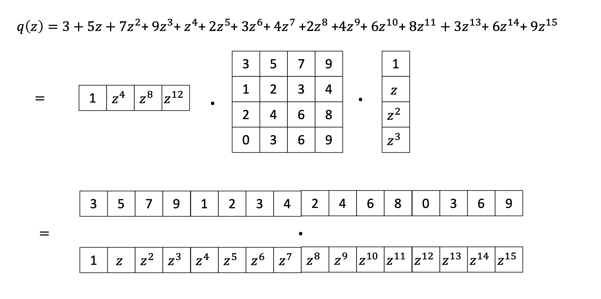
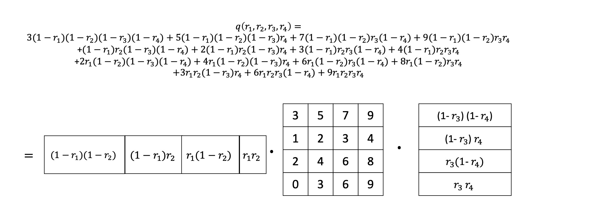

# 第十四章 基于离散对数困难性的多项式承诺

**多项式承诺以及一个简单方案。** 回想一下，所谓的多项式承诺，实际上是针对如下理想化过程的一个模拟。有一个不受信任的证明者 $\mathcal{P}$，他脑子里有一个多项式 $q$（在所谓<u>简洁论证</u>的相关应用里面，对于多项式 $q$，我们主要关心两种情况，一是单变量多项式，一是多线性多项式）。 $\mathcal{P}$ 向验证者 $\mathcal{V}$ 发送 $q$ 的完整描述（比如， $q$ 的所有系数组成的列表）。 $\mathcal{V}$ 得到 $q$ 后，可以选择任何点 $z$，并在 $z$ 点对多项式 $q$ 进行赋值。而一旦 $\mathcal{P}$ 将多项式 $q$ 发送给 $\mathcal{V}$，无论 $\mathcal{V}$ 选择在哪个点对多项式进行赋值， $\mathcal{P}$ 都无法再更换多项式 $q$ 本身（译者：“无法更换”在这里过于明显，让人觉得多此一举，其贴切含义需要阅读后续内容）。在上述过程中， $\mathcal{P}$ 显式地将多项式 $q$ 的完整描述发送给 $\mathcal{V}$，我们称其为一个平凡的多项式承诺方案。

上述平凡的多项式承诺方案存在三个潜在问题，其中有两个和效率有关。

* 如果将多项式承诺应用于 SNARK（见第7-10章），多项式 $q$ 可能非常大。 事实上， $q$ 通常与所要证明的整个命题一样大。因此，让 $\mathcal{P}$ 将 $q$ 的所有系数都发送给 $\mathcal{V}$ 的话，将产生大量的通信。所以，使用上述平凡的多项式承诺将无法产生<u>简洁论证</u>。

* $\mathcal{V}$ 为了计算 $q(z)$ ，需要花费的时间将与多项式的系数个数成正比。如果我们希望产生更加节省计算量的论证， 也就是说，希望验证者能够更快的接收并验证证据的话， 上述平凡的承诺方案将无法满足要求。

* $\mathcal{V}$ 获得了整个多项式 $q$。这可能与零知识的要求冲突。在 SNARK 的应用中， $q$ 通常是某个证据的编码，而将整个 $q$ 发送给 $\mathcal{V}$ 的话， 就泄漏了这个证据的全部。

使用密码学工具，我们可以在克服上述三个问题的同时，实现与平凡多项式承诺方案相同的功能。具体而言，针对多项式 $q$ ， $\mathcal{P}$ 可以计算一个压缩的承诺 $c$，并把 $c$ 发送给验证者。压缩意味着 $c$ 比 $q$ 小得多，这就解决了关于简洁性的第一个问题。同时，由于 $c$ 比 $q$ （译者：原文为 $p$ ，疑似有误） 本身小，所以 $c$ 并未将 $\mathcal{P}$ 拥有的 $q$ 完全固定下来。这也就是说，对许多不同的多项式而言， $c$ 都是有效的承诺，对随后的进一步的验证请求， $\mathcal{P}$ 还有一定的选择空间。当验证者要求 $\mathcal{P}$ 计算 $q(z)$ 时， $\mathcal{P}$ 还能够在多个符合承诺为 $c$ 的多项式中，选择一个 $p$ ，并返回对应的赋值 $p(z)$。虽然如此，我们依然可能设计出一种多项式承诺方案，并要求其在可计算意义上对 $q$ 进行了固定。这里的意思是，任何<u>有效证明者</u>（比如，无法解决离散对数问题，或在密码哈希函数中无法找到碰撞的证明者），在处理针对所承诺的多项式的赋值请求 $z$ 时，都无法用 $q(z)$ 以外的任何值来进行回应。更准确地说，除了声称 $q(z)$ 的值为 $v$ 之外，证明者还将发送一个赋值证明 $\pi$。<u>可计算约束</u>保证了，除非有 $v=q(z)$，否则任何<u>有效证明者</u>都无法生成一个令人信服的 $\pi$。

在前面的章节中，我们介绍过一些多项式承诺方案（例如，第10.4.2节和第10.5节）。在本章，我们将讨论更多的承诺方案。这些方案和之前的那些方案类似，在 $\pi$ 的验证上，所花费的时间，相比于即使仅仅读取完整 $q$ 所需的时间，都要少得多。这就解决了平凡承诺方案的前两个问题（即简洁性和验证需要花费太多时间的问题）。我们还将看到一些方案，在这些方案中，证据 $\pi$ 不会泄露关于 $q$ 的任何信息。甚至还有一些方案，其中验证者实际上连 $q(z)$ 都不知道，而作为替代，只会得到一个 $q(z)$ 的隐藏承诺。有了这些方案，多项式承诺就可以支持<u>零知识</u>，而不会泄露关于 $q$（当然也包括它所编码的证据）的任何信息给验证者。

**披露 $q(z)$ 本身还是对 $q(z)$ 的承诺。** 本章描述的多项式承诺方案，将向验证者披露赋值 $v = q(z)$ 的<u>（Pedersen）承诺</u>（译者：而不是 $v$ 本身）。这是因为第13.2节中的<u>零知识论证</u>需要如此。而其它<u>零知识论证</u>（如第13.3节）则要求 $v$ 被显式的披露出来。幸运的是，如果想要修改本章的承诺方案，以向验证者披露 $v$ ，也是比较容易做到的。例如，可以让证明者使用协议3，在保证零知识的同时，向验证者<u>打开</u>对 $v$ 的承诺，也就是披露 $v$ 的值（参见第12.3.1节的最后一段）。而后面将在第15章描述，在基于<u>配对</u>的多项式承诺方案中，赋值 $v = q(z)$ 将被显式的披露给验证者。

**前面章节的多项式承诺对比本章将要描述的方案。** 之前讲到，一种构建多项式承诺的方法是，将某种合适的PCP或IOP与<u>Merkle哈希</u>结合起来（第10.4.2节和第10.5节）。相比于<u>Merkle哈希</u>方法利用的是“对称密钥”的<u>密码学原语</u>（即抗碰撞哈希函数，结合<u>随机预言机模型</u>以消除交互），本章的方法则基于“公钥”<u>密码学原语</u>。“公钥”<u>密码学原语</u>依赖于更强的密码学假设，例如<u>椭圆曲线群</u>中<u>离散对数问题</u>的难解性。在第16.3节中，我们将讨论两种承诺的各自优缺点，即基于IOP的多项式承诺，以及本章将描述的承诺方案。

**本章所描述方案的概述。** 目前已知的多项式承诺方案，比想象中的往往更具一般性。这些方案中，证明者被要求对任意向量 $u \in 𝔽_n$ 进行承诺，并在随后响应验证者提出的向量请求 $y \in 𝔽_n$，提供关于 $y$ 与 $u$ 的内积的某个命题的证明。在多项式承诺方案中，多项式 $q$ 会以某种基的方式来表示，而 $u$ 是相应的 $q$ 的系数（例如，单变量多项式可以用<u>标准单项式</u>为基进行表示，而<u>多线性多项式</u>则可以用<u>拉格朗日基</u>来表示）。赋值 $q(z)$ 就相当于计算 $y$ 和 $u$ 的内积，这里的 $y$ 是所有<u>基多项式</u>在 $z$ 处进行赋值而得到的向量。

举个例子，如果 $q$ 是单变量多项式， $q$ 可以表示为  $q(X)=\displaystyle\sum_{i=0}^{n-1} u_i X^i$  。而对于任意 $z$， $q$ 在 $z$ 处的赋值为 $q(z) = \langle u,y \rangle = \displaystyle\sum_{i=0}^{n-1} u_i y_i$，也就是 $u$ 和  $y$ 的内积。其中 $y$ 由 $z$ 的各次幂组成，表示为 $y = (1, z, z^2, ..., z^{n-1}) $。类似地，如果 $q$ 是多线性的， $q$ 可以表示为 $q(X) = \displaystyle\sum_{i=0}^{2^\ell} u_i \chi_i(X)$，其中 $\chi_1,...,\chi_{2^\ell}$  表示<u>拉格朗日基多项式</u>的自然枚举（注： 165）。那么对于任意 $z \in 𝔽_p^\ell$ , $q(z) = \langle u,y \rangle$ 。这里 $y = \langle \chi_1(z),...,\chi_{2^\ell}(z) \rangle$ 是这些基多项式在 $z$ 处的赋值。

注165：参考引理3.7中，对<u>拉格朗日基多项式</u>的定义。而<u>拉格朗日基多项式</u>的自然枚举可以这样表示：假设 $i$ 的二进制表示为 $i_1, ..., i_\ell \in {\lbrace 0,1\rbrace}^\ell$ ， $\chi_i(X_1,...,X_\ell)$ 
$=\displaystyle\prod_{j=1}^{\ell} \big(X_j i_j + (1 - X_j)(1- i_j)\big)$ 
$=\bigg(\displaystyle\prod_{j: i_j=1} X_j\bigg) \bigg(\displaystyle\prod_{j:i_j=0} (1-X_j) \bigg)$ 。

因此，要给出 $q$ 的承诺，只需给出 $q$ 的系数向量 $u$ 的承诺。而且，要披露 $q(z)$ 或者披露 $q(z)$ 的承诺，只需披露 $u$ 与向量 $y$ 的内积或者其承诺即可。

**赋值向量中的张量结构。** 和10.5.1节中一样，在上述的无论单变量还是多线性多项式情形中，向量 $y$ 都具有<u>张量积</u>的结构。在本章将讨论的一部分多项式承诺方案中，这种张量结构将会被利用上（尤其是14.3节和15.4节中的方案）。其它方案则支持用任意向量 $y$ 和承诺向量进行内积。

这里的所谓张量结构可以这样来描述。在单变量多项式情形中，设 $n-1$ 为多项式 $q$ 的次数，并假设 $n=m^2$ 是一个完全平方数，定义 $a,b \in 𝔽_m$ 为 $a := (1,z,z^2,...,z^{m-1})$ 以及 $b := (1,z^m,z^{2m},...,z^{m(m-1)})$  （译者：需要将 $a,b$ 当作列向量）。如果我们将 $y$ 视为一个的 $m \times m$ 阶矩阵，并且其元素可以用 $(y_{1,1},...,y_{m,m})$ 来进行索引的话， $y$ 就是 $a$ 和 $b$ 的外积 $b\cdot a^T$ 。也就是， $y_{i,j} = z^{i\cdot m+j} = b_i \cdot a_j$ 。同样，如果 $q$ 是 $\ell$ 元多线性多项式，假设 $2^\ell = m^2$ ，用 $z_1,z_2 \in 𝔽^{\ell/2}$ 分别表示 $z \in 𝔽^\ell$ 的前半部分和后半部分，然后让 $\chi'_1,...,\chi'_m$ 表示 $(\ell/2)$ 元拉格朗日基多项式的自然枚举，并定义 $`a,b \in 𝔽_m`$ 为 
$`a := \big(\chi'_1(z_1),...,\chi'_m(z_1)\big)`$ ， 
$`b := \big(\chi'_1(z_2),...,\chi'_m(z_2)\big)`$ ， 
那么 $`y = b \cdot a^T`$ 。也就是说，$`y_{i,j} = \chi_{i \cdot m + j}(z)= \chi'_i(z_1) \cdot \chi'_j(z_2) = b_i \cdot a_j`$ 。

总结一下，对于单变量和多线性多项式 $q$ ，一旦承诺了 $q$ 的系数向量 $u$ ，计算 $q(z)$ 等同于计算 $u$ 与满足 $y_{i,j} = b_i \cdot a_j$ 的向量 $y$ 的内积，其中 $a,b$ 是某个 $m$ 维向量，而 $m$ 是 $q$ 的系数个数的平方根。等价的，我们可以将 $u$ 和 $y$ 的内积表示为<u>向量-矩阵-向量</u>的乘积： (14.1)

$$ \langle u,y \rangle = \displaystyle\sum_{i,j=1,...,m} u_{i,j} b_ i a_j = b^T \cdot u \cdot a$$

在上述等式的右侧，我们将 $u$ 当作一个 $m \times m$ 阶矩阵。具体的例子，可以参见图 14.1 和 14.2。

## 14.1 线性大小承诺的零知识方案

我们先来描述一个方案，该方案并不比所谓平凡承诺的代价小，但它确实是零知识的。也就是说，证明者对 $q$ 的承诺和 $q$ 本身一样大，而且只要得到这个对 $q$ 的承诺，验证者就可以选择任意的 $z$ ，并自行计算出对赋值 $q(z)$ 的承诺。

回顾一下，在Pedersen承诺（第12.3节）中，我们有一个阶为素数 $p$ 的群 $𝔾$，以及生成元 $g,h$ ，对值 $m \in 𝔽_p$ ，其承诺为 $c \gets h^m \cdot g^r$ ，其中 $r \in \lbrace 0,...,p-1 \rbrace$ 是一个由承诺者选择的随机值。Pedersen承诺是完全隐藏和计算约束的 (perfectly hiding and computationally binding)。

**承诺阶段。** 为了对多项式 $q$ 进行承诺，在平凡承诺方案中，证明者直接把多项式的系数向量 $u$ 发送给验证者，但在本方案中，验证者转而发送 $u$ 的每个元素 $u_i$ 的Pedersen承诺 $c_i$。Pedersen承诺是隐藏的（hiding），所以接收承诺 $c_i$ 的人将对 $u$ 一无所知。

**赋值阶段。** 设 $y$ 为一个向量，而 $q(z) = \langle u,y \rangle = \displaystyle\sum_i u_i y_i$。由于验证者知道 $y$ ，并且知道 $u$ 的每个元素 $u_i$ 的承诺 $c_i$ ，利用Pedersen承诺的同态性质，验证者可以自行计算出对 $\displaystyle\sum_i u_i y_i$ 的承诺 $c$ 。 $\mathcal{P}$ 可以通过协议7（第12.3.1节），零知识的证明它知道如何打开承诺 $c$ 。

图14.1：使用标准单项式为基，一个 $15$ 度一元多项式 $q$ 可以如图表示。第二行中，对任何输入 $z$ , 赋值 $q(z)$ 表示为向量-矩阵-向量乘积，其中矩阵由 $q$ 的系数组成，而两个向量由 $z$ （译者：原文为 $r$ ，疑似有误）确定。第三行中， $q(z)$ 可以等价的表示为 $q$ 的系数向量与“赋值向量”的内积，其中所谓的赋值向量由 $z$ 的各阶幂组成。

图14.2：使用<u>拉格朗日基</u>（见引理3.7），一个 $4$ 元多线性多项式 $q$ 可以如图表示。对任何输入 $r = (r1,r2,r3,r4) \in 𝔽^4$ ，多项式的赋值 $q(r)$ 可以表示为向量-矩阵-向量的乘积，其中矩阵由 $q$ 的系数组成，而两个向量由赋值点 $r$ 确定。

**可提取性（Extractability）。** 在上述方案中，如果承诺者在发送承诺之前，就已经知道了多项式将在哪个 $z$ 处进行赋值，那么正如我们马上要解释的，承诺者实际上拥有这样的能力，一方面，承诺者发送的系数承诺 $c_i$ 他自己实际上完全无法打开， 而同时，针对验证者自行计算的赋值承诺 $c$ ，承诺者却又可以用任意自己选择的 $a \in 𝔽_p$ 来进行打开。换句话说，在这种设定下，该承诺方案是不可提取的（参见第7.4节），即证明者可以响应验证者的赋值请求，而且响应的值能够通过验证者的检验，但实际上他又并不知道一个多项式 $p$ ，符合指定次数，并符合最初的承诺以及后续给出的赋值响应。

例如，若 $n=2$ ，则多项式承诺由两个Pedersen承诺 $c_0$ 和 $c_1$ 组成，它们表面上分别是对多项式的两个系数的Pedersen承诺。简单起见，假设Pedersen承诺方案中，作为盲因子(blinding factor)的群生成元 $h$ 是 $𝔾$ 中的单位元（相当于说，盲因子从Pedersen承诺方案中被省略掉了）。

然后，承诺者可以随机选择一个群元素作为 $c_0$ ，这也意味着承诺者无法打开 $c_0$ 。承诺者将 $c_1$ 选为 $`\big( g^a \cdot c_0^{-1} \big) ^{z^{-1}}`$ ，这里 $z^{-1}$ 表示 $z$ 模 $p$ 的乘法逆。这样的选择下，验证者在赋值阶段，针对 $z$ 处的赋值承诺是 $c$ 是 $c_0 \cdot c_1^{z} = g^a$ ，也就是说承诺者可以用 $a$ 打开 $c$ ，而同时，承诺者完全无法打开系数承诺 $c_0$ 和 $c_1$。

一种解决上述问题的方法是，去修改承诺阶段，要求承诺者使用协议7，零知识的证明，他能够打开每个系数Pedersen承诺 $c_i$ 。当然，这种方案增加了承诺阶段的复杂度。

在多项式承诺方案应用于简洁论证时，赋值点 $z$ 是由验证者随机选取的，并且在发送多项式承诺时，证明者是不知道 $z$ 的。这种情况下，上述多项式承诺方案是可提取的（无需修改承诺阶段即可）。具体来说，通过随机选择许多不同的赋值点，提取过程可以找到 $n$ 个点 $z^{(1)},...,z^{(i)}$ 。在这些点上，承诺者响应的值，可以通过验证者的检查。如果用 $y^{(i)}$ 表示 $q(z^{(i)}) = \langle u,y^{(i)} \rangle$ 中的 $y$ 向量，而承诺者打开的赋值是 $q(z^{(i)})=v^{(i)}$ （注166)， 那么将得到 以 $u$ 的 $n$ 个元素作为变量的 $n$ 个线性独立方程。其中第 $i$ 个方程为 $\langle u,y^{(i)} \rangle = v^{(i)}$。然后，提取者使用高斯消元法就能快速的求解这 $n$ 个方程，从而计算出 $u$ 的元素的值，也就是，承诺的多项式 $q$ 的各个系数。

在第14.3节中，我们将讨论一个具有平方根验证成本的多项式承诺方案。上述结论也适用于该承诺方案。

## 14.2 常量大小承诺，线性大小赋值证明

在14.1节的方案中，承诺与被承诺的多项式一样大。在本节，我们给出另外一个方案，其承诺的大小将减小为常数（承诺为单个群元素）。但是，不幸的是，赋值证明（同样，验证时间）将会变得非常大，与多项式本身一样大。（注167）

注166：准确地说，承诺者在这一节的方案中并未显式地揭示赋值 $v^{(i)}$。但是，承诺者使用协议7证明其拥有 $v^{(i)}$ 的值，而由于协议7的knowledge-soundness， $v^{(i)}$ 实际上可以从承诺者被那里有效地提取出来。

注167：这一节的方案中，公共参数(public parameters)的数量也将非常大。它们由 $n$ 个随机选择的群元素 $g_1,...,g_n$ 组成，其中 $n$ 是系数向量 $u$ 的大小。但是在随机预言机模型中， $g_i$ 可以通过在输入 $i$ 处对随机预言机进行求值来得到。如此的话，公共参数个数将为常数。

**承诺阶段。** 设 $n$ 个生成元 $g_1,...,g_n$ 是从 $𝔾$ 中随机选取的。为了对 $u \in 𝔽_p^n$ 的进行承诺，承诺者随机选择一个值 $`r_u \in \{0,1,...,|𝔾|−1\}`$ ，并发送承诺值 $Com(u;r_u):= h^{r_u} \cdot \displaystyle\prod_{i=1}^n g_i^{u_i}$ 。这个承诺通常被称为广义Pedersen承诺，或者Pedersen向量承诺（标准的Pedersen承诺等同于 $n=1$ 时的广义Pedersen承诺）。注意，Pedersen向量承诺是同态的：给定两个向量 $u$ 和 $w$ ，其承诺分别为 $c_u,c_w$ ，对任何两个标量 $a_1,a_2 \in 𝔽_p$ ，可以计算出线性组合 $a_1 u + a_2 w$ 的一个承诺值，为 $c_u^{a_1} \cdot c_w^{a_2}$ 。

在这里，我们可以对比一下Pedersen向量承诺与第14.1节的方案。该方案中，为了对向量 $u \in F_p^n$ 进行承诺，需要分别发送 $u$ 的每个元素的Pedersen承诺（所有 $n$ 个承诺使用相同的群生成元 $g$ ）。这并不是一个压缩承诺。而Pedersen向量承诺对 $u$ 的每个元素 $u_i$ 分别计算一个Pedersen承诺 $g_i^{u_i}$ （但没有盲化因子，见注160），其中每个承诺使用的群生成元 $g_i \in 𝔾$ 是不同的（注168）。然后，通过使用 $𝔾$ 的群操作，所有的 $n$ 个承诺被“压缩”成了一个单一的承诺值，并在接下来被因子 $h^{r_u}$ 进行了盲化处理。

**求值阶段。** 回忆一下，对一个承诺过的多项式 $q$ ，要在某个输入 $z$ 处求值的话，相当于计算系数向量 $u$ 和向量 $y$ 的内积 $\langle u,y \rangle$ ，这里向量 $y$ 从 $z$ 计算得到。假设我们已经知道了多项式的承诺 $c_u = Com(u, r_u)$ ，公开的查询向量 $y$ ，以及一个承诺 $c_v = Com(v,r_v) = g_1^{v} \cdot h^{r_v}$ ，其中 $v= \langle u,y \rangle$，并且只有承诺者知道 $r_u$ 和 $r_v$ ，验证者并不知道。承诺者希望以零知识的方式证明，他知道 $c_u$ 的打开 $u$ 以及 $c_v$ 的打开 $v$ ，并有 $\langle u, y \rangle = v$ ，除非证明者可以打破承诺的绑定性，否则这等价于证明了 $q(z) = v$ 。

与协议7一样（见12.3.1节的结尾），直接打开 $u$ 和 $v$ 的承诺可以让验证者很容易对 $v = \langle u, y \rangle$ 进行检查，但这会违反零知识的要求。所以，证明者转而打开一种衍生承诺。证明者和验证者都将在衍生承诺中加入随机性，并同时保证衍生承诺和原始承诺满足证明者声称的相同的性质。

具体而言，承诺者首先生成一个随机的 $n$ 维向量 $`d \in \{0, ..., p−1\}^n`$，以及两个随机数 $`r_1,r_2 \in \{0,...,p−1\}`$ 。然后，承诺者发送两个值 $c_1,c_2 \in 𝔾$，并声称它们分别等于 $Com(d,r_1)$ 和 $Com(\langle d,y\rangle,r_2)$ 。验证者回应一个随机挑战 $`e \in \{0,...,p−1\}`$。证明者再次回应三个数量 $`u',r_u',r_v' \in \{0,...,p−1\}`$ ， 并声称分别等于以下的值（所有算术运算都在模 $p$ 意义下完成）：

(14.2)

$$`e \cdot u + d \in \{0,...,p-1\}^n`$$ 

(14.3)

$$`e \cdot r_u + r_1 \in \{0,...,p-1\}`$$

(14.4)

$$`e \cdot r_v + r_2 \in \{0,...,p-1\}`$$

最后，验证者检查下面等式是否成立: $c^e_u \cdot c_1 = Com(u',r_u')$ 和 $c^e_v \cdot c_2 = Com(\langle u',y \rangle,r_v')$。

注168: 如果对所有 $i$ 都使用同一个群生成元 $g$ 的话，承诺 $\displaystyle\prod_{i=1}^n g^{u_i}$ 将不会把承诺者绑定到向量 $u$ 上，而只是绑定到 $u$ 的某个重排列上。例如，如果 $n = 2$ ，那么 $u = (1, 2)$ 将产生与 $u = (2, 1)$ 相同的承诺：在第一种情况下，承诺将是 $g^2 \cdot g = g^3$ ，在第二种情况下，承诺将是 $g \cdot g^2$ ，也等于 $g^3$。 （译者：实际上，可能连重排列都不需要？比如 $u=(1,2)$ 和 $u=(0,3)$ 将产生相同的承诺）

